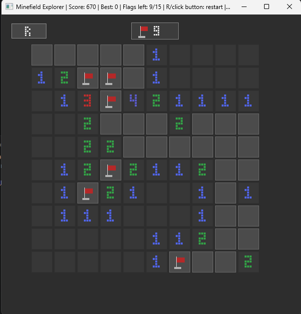

# Minefield Explorer

Minefield Explorer is a simple Minesweeper-style game built in C# and .NET using SDL.

The goal is to reveal all safe cells while avoiding the hidden mines. The game also includes flags, scoring and persistent high scores.

## Screenshots

<table>
  <tr>
    <td align="center"><b>Gameplay</b></td>
    <td align="center"><b>Game Over</b></td>
  </tr>
  <tr>
    <td></td>
    <td></td>
  </tr>
</table>

## Features

- 10x10 game board
- 15 randomly placed mines
- Left click to reveal cells
- Right click to place or remove flags
- Automatic reveal of connected empty areas
- Win and lose states
- Restart option
- Score system
- High scores saved between runs

## Controls

- **Left Click** - reveal a cell
- **Right Click** - place or remove a flag
- **R** - restart the game
- **Escape / Q** - exit

The restart button in the top-left corner can also be clicked.

## How to Run

Requirements:

- .NET

Run the project with:

```bash
dotnet run
```

## Project Structure

The project is split into a few main parts:

- `Board/` - Minesweeper board logic, mines, cells and reveal logic
- `Game/` - main game loop, input handling and game state
- `Rendering/` - SDL rendering for the board and interface
- `Persistence/` - saving and loading high scores
- `Program.cs` - application entry point

## C# / .NET Concepts Used

The project uses several concepts I practiced during the course:

- classes and enums
- record structs
- LINQ
- async/await
- `IDisposable`
- JSON serialization

## About

This project was created as part of a .NET university assignment.

The SDL starter skeleton was provided during the laboratory, and I used it to build the Minesweeper game logic, rendering, scoring and persistence system.
